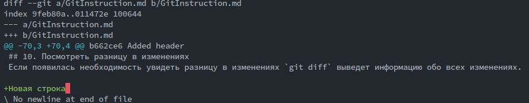

# Работа с Git

## 1. Проверка наличия установленного Git
В терминале выполнить команду `git version`.

Если Git установлен, появится сообщение с информацией о версии программы.
Иначе будет сообщение об ошибке.

## 2. Установка Git
Загружаем последнюю версию Git с сайта https://git-scm.com/downloads.

Устанавливаем с настройками по умолчанию.

## 3. Настройка Git
При первом использовании Git необходимо представиться. Для этого нужно
ввести в терминале две комманды. 

```
git config --global user.name "Ваше имя на английском"
git config --global user.email "Ваша электронная почта"
```

## 4. Инициализация репозитория
Для того, чтобы начать работать с Git, нужно инициализировать репозиторий.
Используем следующую команду `git init`.

## 5. Получить информацию от Git о его текущем состоянии
Если необходимо узнать об изменениях, сделанных в текущей папке, где был инициализированн Git, используем слудующую команду `git status`. С её помощью можно проверить индексацию изменений.

Можно использовать более краткую форму вывода в виде: `git status -s`.

## 6. Добавить файл или файлы к следующему коммиту
Мы должны добавить файлы к нашему репозиторию, чтобы его отслеживал Git. Следующая команда позволяет сделать это: `git add НАЗВАНИЕ ФАЙЛА`.

Если нужно добавить все файлы, которые имеются в текущей директории стоит воспользоваться командой `git add .`, что добавляет все файлы.

## 7. Создание коммита
Чтобы зафиксировать все изменения, которы мы проделали, нужно использовать команду `git commit -m "message"`.

Дабы не повторять использование команды `git add`, следует использовать `git commit -am "message"`. Только при условии того, что вы уже ранее добавляли этот файл.

## 8. Вывод на экран истории всех коммитов с их хеш-кодами
Команда `git log` позволяет посмотреть всю историю коммитов, которые были сделаны.
Существует краткая форма этой команды: `git log --oneline`.

## 9. Переход от одного коммита к другому
Команда `git checkout` позволяет выполнить переход от одного коммита к другому. Чтобы сделать это вам нужно узнать хеш-код коммита, к которому нужно перейти.

Возьмём следующий пример:

```SQL
$ git log --oneline
4e7a1f5 (HEAD -> master) Added new section 8 - Вывод на экран истории всех коммитов с их хеш-кодами.
35c57d2 Added new section 7 - Создание коммита
2987f80 Added new section 6 - Добавить файл или файлы к следующему коммиту
d9550be Edited section 5. Added information
2d59040 Added new section 5 - Получить информацию от Git о его текущем состоянии
37e8111 Added new section 4 - Инициализация репозитория
78b64a8 Added new section 3 - Настройка Git
da10c22 Added new section 2 - Установка Git
c5a43ec Added section 1 - Проверка наличия установленного Git
b662ce6 Added header
8862b00 Initial Commit
```

Хеш-код расположен слева от нужного коммита. Следующий пример демонстрирует переход от текущего коммита **4e7a1f5 (HEAD -> master)** к коммиту **35c57d2**: `git checkout 35c57d2`.

Чтобы вернуться обратно используем следующую комманду: `git checkout master`.

## 10. Посмотреть разницу в изменениях
Если появилась необходимость увидеть разницу в изменениях `git diff` выведет информацию обо всех изменениях.

